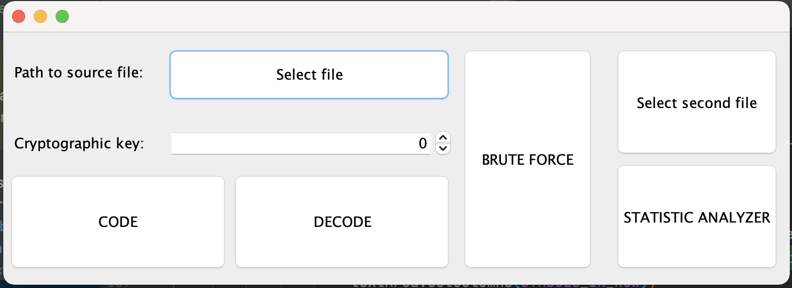
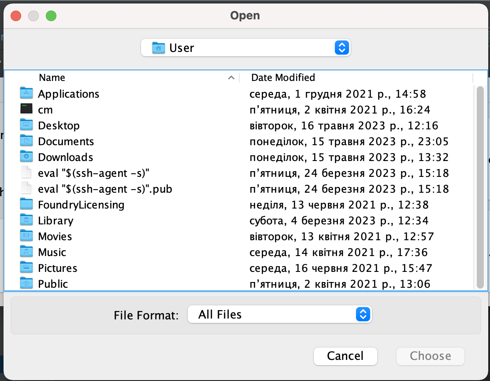
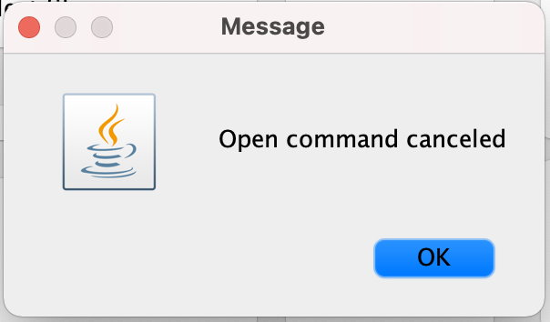
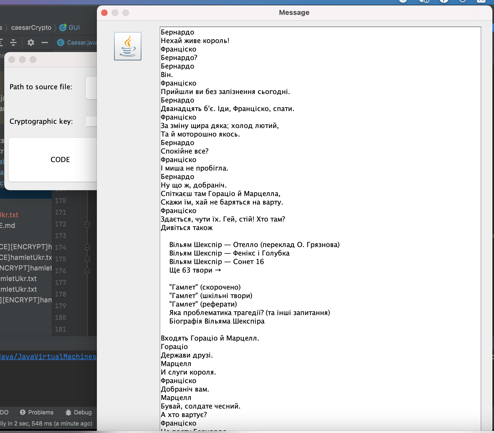
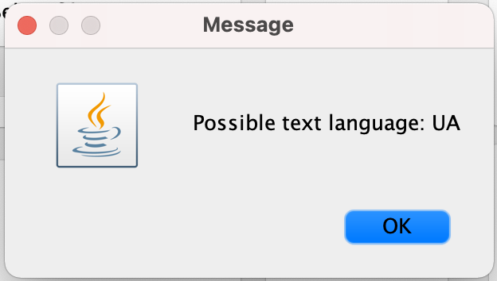
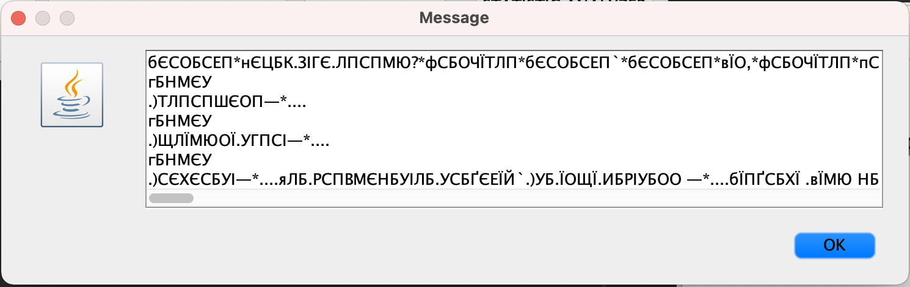
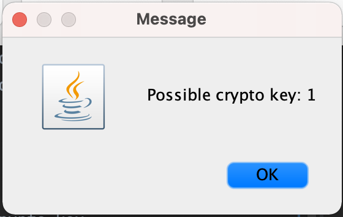
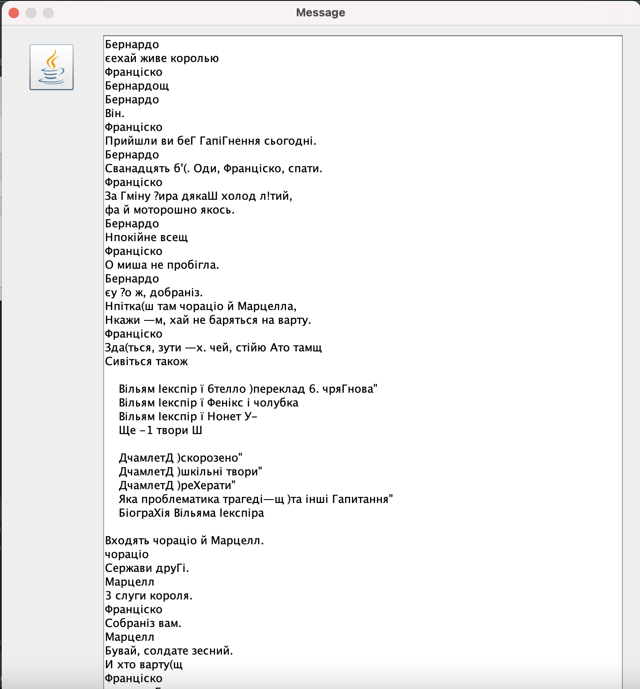

# Caesar
**UI**

**Encrypt article**
1. Click on "Select file" btn 
2. OS File Chooser should appear 
3. Select file. 
_In case if close without choosing file_  
4. If article has been chosen successful. User will see text preview 
5. Language in file will be detected automatically 
6. 

`For language definition uses specific language chars:
UA = іґІґЇї;
RU = ыЁёъ;
EN = fFhJjkKgqQr.`
7. Use spinner element for set crypto key
8. Click on code btn
a) Unsupported chars will be replaced
  ` Replace unsupported char: ; to * symbol
   Replace unsupported char: → to * symbol
   Replace unsupported char: [ to * symbol
   Replace unsupported char: ] to * symbol`
b) Article with prefix [ENCRYPT] + base article name will be created
c) Code text preview will be shown 
* Important, "Enter symbol" will be coded too.

**Decrypt article**
1. Click on "Select file" btn
2. OS File Chooser should appear
3. Select file.
   _In case if close without choosing file_ 
4. If article has been chosen successful. User will see text preview
5. Language in file will be detected automatically !
   `For language definition uses specific language chars:
   UA = іґІґЇї;
   RU = ыЁёъ;
   EN = fFhJjkKgqQr.`
6. Use spinner element for set crypto key
7. Click on code btn
   a) Article with prefix [DECRYPT] + base article name will be created. Previous prefix will be removed.
   c) Decode text preview will be shown

**Brute force article**
1. Click on "Select file" btn
2. OS File Chooser should appear
3. Select file.
   _In case if close without choosing file_ 
4. If article has been chosen successful. User will see text preview
5. Language in file will be detected automatically !
   `For language definition uses specific language chars:
   UA = іґІґЇї;
   RU = ыЁёъ;
   EN = fFhJjkKgqQr.`
6. Click "Brute force" btn
a) Message with possible crypto key will be shown 
b) For found key we use 4 rules: space after dot, space after comma, row should have dot in the end and row should start with char in uppercase.
We consider the most likely key to be the key that corresponds to the largest number of rules.
с) Article with prefix [BRUTE_FORCE] + base article name will be created. Previous prefix will be removed.
в) Decode text preview will be shown.

**Frequency decrypt article**
1. Click on "Select file" btn
2. OS File Chooser should appear
3. Select file.
   _In case if close without choosing file_
4. If article has been chosen successful. User will see text preview
5. Language in file will be detected automatically !
   `For language definition uses specific language chars:
   UA = іґІґЇї;
   RU = ыЁёъ;
   EN = fFhJjkKgqQr.`
6. Click on "Select second" file btn.
7. Click "Statistic analyzer" btn
   a) For texts in both files, the frequency of repetitions in the text is calculated. It is sorted and superimposed on one another.
   и) Article with prefix [FREQUENCY] + base article name will be created. Previous prefix will be removed.
   в) Decode text preview will be shown. 

